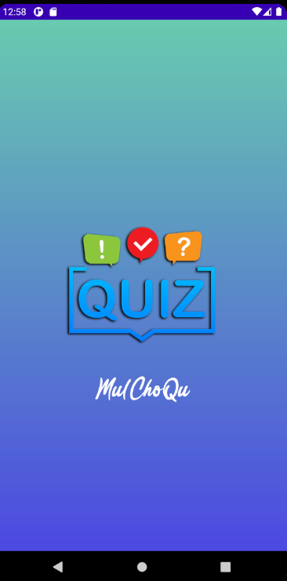
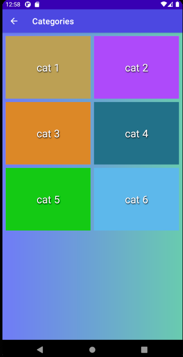
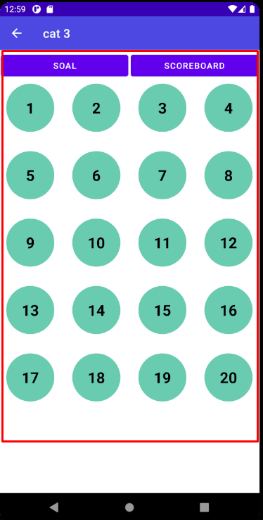

# 00 - Project

## Tujuan Pembelajaran

1. Implementasikan materi/pertemuan sebelumnya tentang data binding, fragment, navigation, dan ViewModel pada ide project akhir Anda! (minimal 1 fitur tiap materi tersebut) Cantumkan tautan github Anda yang tertuju pada file markdown (.md) berisi screenshot tiap fitur tersebut.

2. Jelaskan perbedaan Data Binding dan ViewModel ? lalu pada saat kapan harus menggunakan Data Binding dan ViewModel ? (Mohon cantumkan referensinya).

3. Jelaskan perbedaan fragment dan Activity ? lalu pada saat kapan harus menggunakan fragment dan Activity ? (Mohon cantumkan referensinya).


<br/><br/>

## *Pertanyaan 1*

<br/><br/>


Splash :

<br/>

>:

<br/>

recycler view :

<br/>

>:

<br/>

GridView + fragment :

>:

```xml
<FrameLayout
            android:id="@+id/fragment"
            android:name="com.haidar.mulchoqu.fragment.SoalFragment"
            android:layout_width="match_parent"
            android:layout_height="560dp"
            android:layout_margin="4dp" />
}
```

navigation

```java
Toolbar toolbar = findViewById(R.id.toolbar);
        setSupportActionBar(toolbar);
        getSupportActionBar().setTitle("Categories");
        getSupportActionBar().setDisplayHomeAsUpEnabled(true);
}
```

view Model

```java
package com.haidar.mulchoqu.viewmodel;

import androidx.lifecycle.MutableLiveData;
import androidx.lifecycle.ViewModel;

public class DataViewModel extends ViewModel {

    private MutableLiveData<String> mClicked = new MutableLiveData<>();


    public String getClicked() {
        return mClicked.getValue();
    }

    public void setClicked(String clicked) {
        mClicked.setValue(clicked);
    }

}

}
```

XMl data binding dan viewmodel

```xml
<?xml version="1.0" encoding="utf-8"?>
<layout xmlns:android="http://schemas.android.com/apk/res/android"
    xmlns:tools="http://schemas.android.com/tools">

    <data>
        <variable
            name="viewmodel"
            type="com.haidar.mulchoqu.viewmodel.DataViewModel" />
    </data>

    <FrameLayout
        android:layout_width="match_parent"
        android:layout_height="match_parent"
        tools:context=".fragment.SoalFragment">

        <!-- TODO: Update blank fragment layout -->


        <LinearLayout
            android:layout_width="match_parent"
            android:layout_height="match_parent"
            android:orientation="vertical"
            android:gravity="center">


            <GridView
                android:id="@+id/grid_view"
                android:layout_width="match_parent"
                android:layout_height="500dp"
                android:layout_weight="1"
                android:columnWidth="100dp"
                android:gravity="center"
                android:horizontalSpacing="16dp"
                android:numColumns="4"
                android:verticalSpacing="32dp" />

            <TextView
                android:id="@+id/clicked"
                android:layout_width="match_parent"
                android:layout_height="wrap_content"
                android:text="@{viewmodel.clicked}" />
        </LinearLayout>

    </FrameLayout>
</layout

}
```

java data binding dan viewmodel


```java
public class SoalFragment extends Fragment {
    private GridView dataList;
    private DataViewModel viewModel;
    FragmentSoalBinding binding;

    @Override
    public View onCreateView(LayoutInflater inflater, ViewGroup container,
                             Bundle savedInstanceState) {
        // Inflate the layout for this fragment
        binding = DataBindingUtil.inflate(inflater, R.layout.fragment_soal, container, false);

        binding.setLifecycleOwner(this);
        viewModel = new ViewModelProvider(requireActivity()).get(DataViewModel.class);

        binding.setViewmodel(viewModel);

        return binding.getRoot();
    }

    @Override
    public void onViewCreated(@NonNull View view, @Nullable Bundle savedInstanceState) {
        super.onViewCreated(view, savedInstanceState);
        dataList= view.findViewById(R.id.grid_view);

        GridSetsAdapter adapter = new GridSetsAdapter(20);
        dataList.setAdapter(adapter);


        dataList.setOnItemClickListener(new AdapterView.OnItemClickListener() {
            @Override
            public void onItemClick(AdapterView<?> adapterView, View view, int i, long l) {
                binding.getViewmodel().setClicked(String.valueOf(i+1));
                binding.clicked.setText(viewModel.getClicked());
            }
        });
    }


}
```


## *Pertanyaan 2*

### Data Binding

Library Data Binding adalah support library yang memungkinkan Anda mengikat komponen UI dalam tata letak ke sumber data di aplikasi Anda menggunakan format deklaratif, bukan secara terprogram.

Tata letak sering ditentukan dalam aktivitas dengan kode yang memanggil metode framework UI. Misalnya, kode di bawah ini memanggil findViewById() untuk menemukan widget TextView dan mengikatnya ke properti userName variabel viewModel dengan data

sc : https://medium.com/gits-indonesia/android-data-binding-7edf75b16067

### View Model

ViewModel bertanggung jawab untuk menyiapkan data untuk UI/View/ Tampilan.
ViewModel merupakan base class yang baik untuk membuat ViewModel karena setiap class yang mengextendnya akan secara otomatis memiliki holding data ketika terjadi perubahan.

sc : https://medium.com/@yogiwisesa/android-mvvm-architecture-7b12a2190028


## *Pertanyaan 3*

Activity merupakan salah satu komponen yang ada di Android Studio yang berfungsi untuk menampilkan user interface (UI) dari aplikasi yang akan dibuat, biasanya diletakkan pada “setcontentview”. Bukan hanya menampilkan UI, activity juga digunakan untuk melakukan berbagai kegiatan yang diperlukan di dalam aplikasi tersebut seperti berpindah dari satu tampilan ke tampilan lainnya, menjalankan program lain, dan masih banyak lagi yang dapat dilakukan di dalam sebuah activity.


Fragment merupakan salah satu komponen pada Android Studio dengan fungsi yang hampir sama seperti activity tetapi memiliki “lifecycle” yang berbeda. Fragment merupakan bagian dari sebuah activity yang mana sebuah fragment tidak akan ada bila tidak ada sebuah activity karena fragment membutuhkan akses dari activity untuk dapat dijalankan.


sc: https://socs.binus.ac.id/2017/09/26/activity-dan-fragment-di-android-studio/