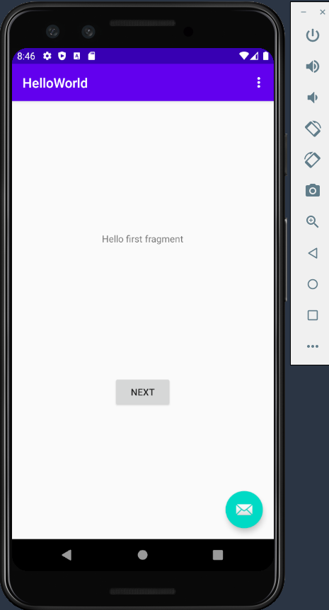

# 01 - Hello World

## Tujuan Pembelajaran

1. Mahasiswa mampu menginstall Android Studio, Android SDK, dan konfigurasi Kotlin
2. Mahasiswa Mampu menginstall Emulator
3. Mahasiswa Mampu Menghubungkan Perangkat Mobile Ke Komputer / Laptop
4. Mahasiswa mampu melakukan instalasi Git dan mengkonfigurasikannya di Android Studio

## Materi Pembelajaran
1. Install Android Studio
2. Konfigurasi Software Development Kit (SDK)
3. Konfigurasi Emulator
4. Konfigurasi Device
5. Install Git
6. Konfigurasi Git ke Android Studio
7. Hello World 1

## Hasil Praktikum

Hasil Screeshot Pembuatan Hello World :
>
