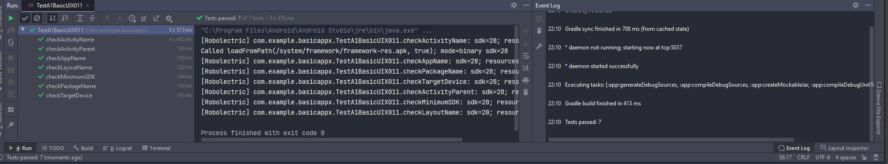
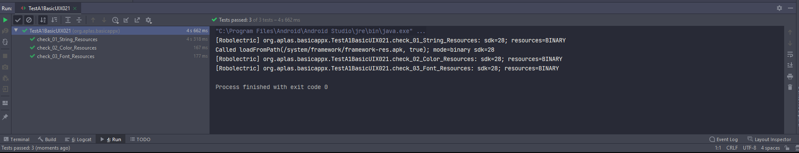
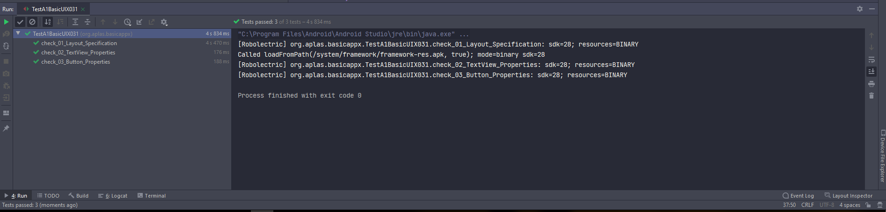
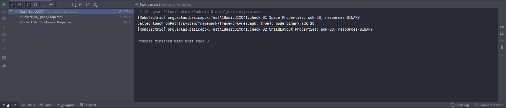
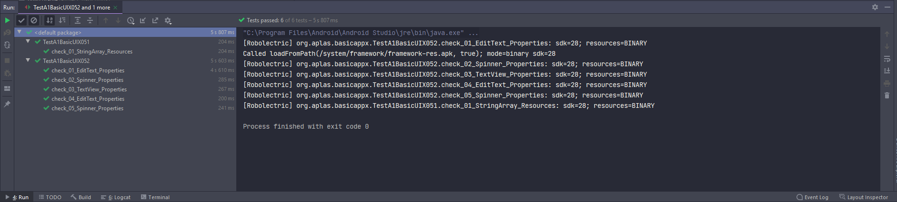
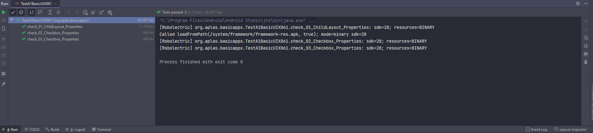
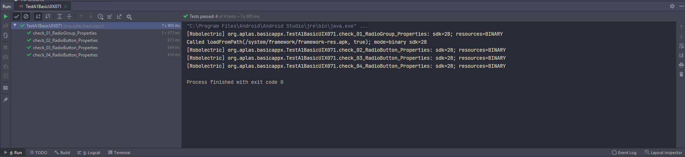
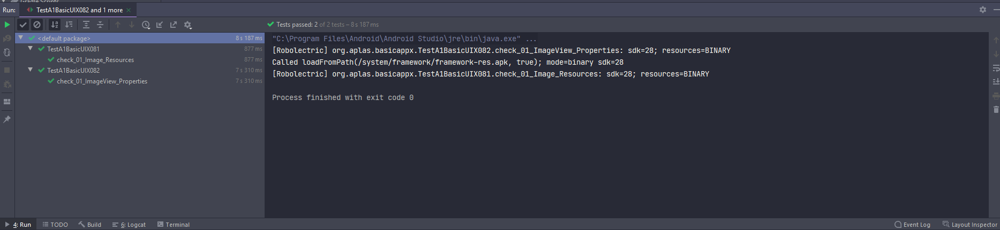
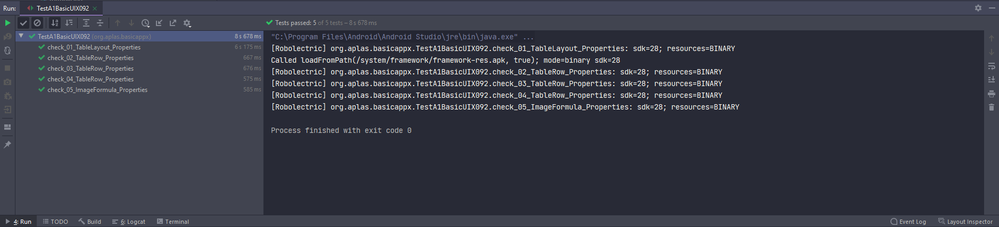

# 02 - Layout

## Tujuan Pembelajaran

1. Mahasiswa memahami konsep layout pada android.
2. Mahasiswa memahami konsep View Group dan Hierarchy pada layout.
3. Mahasiswa mampu membuat layout sederhana.
4. Mahasiswa menguasai layout editor dan kegunaannya pada android studio.

## Materi Pembelajaran
1. Konsep Layout pada project android.
2. View Group dan View Hierarchy pada project android.
3. Basic Layout Editor
4. Project sederhana “Hello Layout”
5. Project sederhana “Score Counter”

## Hasil Praktikum

Hasil screenshoot setiap testing yang di coba :

Testing 1 :

>

Testing 2 :

>

Testing 3 :

>

Testing 4 :

>

Testing 5 :

>

Testing 6 :

>

Testing 7 :

>

Testing 8 :

>

Testing 9 :

>

