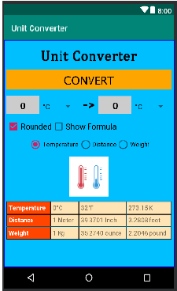

# 02 - Layout

## Tujuan Pembelajaran

1. Mahasiswa memahami konsep layout pada android.
2. Mahasiswa memahami konsep View Group dan Hierarchy pada layout.
3. Mahasiswa mampu membuat layout sederhana.
4. Mahasiswa menguasai layout editor dan kegunaannya pada android studio.

## Materi Pembelajaran
1. Konsep Layout pada project android.
2. View Group dan View Hierarchy pada project android.
3. Basic Layout Editor
4. Project sederhana “Hello Layout”
5. Project sederhana “Score Counter”

## Hasil Praktikum

Hasil screenshoot setiap testing yang di coba pada submission web aplas.polinema.ac.id 

<br/>

### *Graddle Configuration*

<br/>

The function change :

1. Build types define certain properties that Gradle uses when building and packaging your app
2. Product flavors represent different versions of your app that you may release to users, such as free and paid versions of your app
3. A build variant is a cross product of a build type and product flavor, and is the configuration Gradle uses to build your app
4. You can specify values for some properties of the manifest file in the build variant configuration. These build values override the existing values in the manifest file. This is useful if you want to generate multiple APKs for your modules where each of the apk files has a different application name, minimum SDK version, or target SDK version
5. The build system manages project dependencies from your local filesystem and from remote repositories. 
6. The build system enables you to specify signing settings in the build configuration, and it can automatically sign your APKs during the build process.

Source : https://developer.android.com/studio/build?hl=id

Testing 1 :

>

<br/> <br/> <br/>

### *Make Project and put String resource into Project*

<br/>

the function for adding project :

*for this test, we create a stagnant string to represent the text value for one of view on main_activity.xml*

```
function test() {
  <string name="btnText">Convert</string>
}
```
```
 <Button
        android:id="@+id/convertButton"
        android:layout_width="match_parent"
        android:layout_height="20pt"
        android:text="@string/btnText"
        android:textColor="@color/textColor"
        android:textSize="11pt"
        android:background="@color/btnColor"
        android:fontFamily="@font/lucida"
        android:layout_below="@+id/myTextView1"/>
```
Understanding :

A string resource provides text strings for your application with optional text styling and formatting. There are three types of resources that can provide your application with strings:

**String**

XML resource that provides a single string.

**String Array**

XML resource that provides an array of strings.

**Quantity Strings (Plurals)**

XML resource that carries different strings for pluralization.

All strings are capable of applying some styling markup and formatting arguments.

source : https://developer.android.com/guide/topics/resources/string-resource?hl=id

Testing 2 :

>

<br/> <br/> <br/>

### *Make layout inside on activity_main.xml based on constrain and relative layout*

<br/>

in this lesson, you learn how to use the Android Studio Layout Editor to create a layout that includes a text box and a button. This sets up the next lesson, where you learn how to make the app send the content of the text box to another activity when the button is tapped.

Android provides an XML vocabulary for ViewGroup and View classes, so most of your UI is defined in XML files. However, rather than teach you to write XML, this lesson shows you how to create a layout using Android Studio's Layout Editor. The Layout Editor writes the XML for you as you drag and drop views to build your layout.

source : https://developer.android.com/training/basics/firstapp/building-ui?hl=id

The layout result based on spesification document of Aplas :

>

Testing 3 :

>

<br/> <br/> <br/>

### *make a group of layout using linear layout*

<br/>

A layout defines the structure for a user interface in your app, such as in an activity. All elements in the layout are built using a hierarchy of View and ViewGroup objects. A View usually draws something the user can see and interact with. Whereas a ViewGroup is an invisible container that defines the layout structure for View and other ViewGroup objects, as shown in figure 1.

>

in this layout :

```
<LinearLayout
        android:id="@+id/child1"
        android:layout_width="match_parent"
        android:layout_height="wrap_content"
        android:orientation="horizontal"
        android:layout_below="@id/space1" >
        
        <EditText
            android:id="@+id/inputText"
            android:layout_width="0dip"
            android:layout_height="20pt"
            android:layout_weight="0.2"
            android:text="@string/inputText"
            android:textColor="@color/textColor"
            android:textSize="10pt"
            android:textStyle="bold"
            android:fontFamily="@font/cambria"
            android:gravity="center"
            android:background="@color/etBgColor"
            android:inputType="number"
            android:hint="@string/hint"
        />
```

Testing 4 :

>

<br/> <br/> <br/>

### *Add string array to resoruce and show it with spinner*

<br/>

Spinners provide a quick way to select one value from a set. In the default state, a spinner shows its currently selected value. Touching the spinner displays a dropdown menu with all other available values, from which the user can select a new one.

>

```
<Spinner
            android:id="@+id/oriList"
            android:layout_width="0dip"
            android:layout_height="20pt"
            android:layout_weight="0.24"
            android:entries="@array/tempList"
            android:prompt="@string/inputPrompt"
            android:spinnerMode="dialog"
            android:gravity="center"/>
```

```
<string-array
        name="tempList">
        <item>°C</item>
        <item>°F</item>
        <item>K</item>
    </string-array>
```
source :https://developer.android.com/guide/topics/ui/controls/spinner

Testing 5 :

>

<br/> <br/> <br/>

### *Add checkbox with new linear layout*

<br/>

Checkboxes allow the user to select one or more options from a set. Typically, you should present each checkbox option in a vertical list.

```
<LinearLayout
        android:id="@+id/child2"
        android:layout_width="match_parent"
        android:layout_height="wrap_content"
        android:orientation="horizontal"
        android:layout_below="@id/child1"
        android:layout_marginTop="5pt"
        >

        <CheckBox
            android:id="@+id/chkRounded"
            android:layout_width="wrap_content"
            android:layout_height="wrap_content"
            android:text="@string/chkRound"
            android:textSize="8pt"
            android:gravity="center"
            android:checked="true"
            />
        <CheckBox
            android:id="@+id/chkFormula"
            android:layout_width="wrap_content"
            android:layout_height="wrap_content"
            android:text="@string/chkForm"
            android:textSize="8pt"
            android:gravity="center"
            />
```
<br/>

source : https://developer.android.com/guide/topics/ui/controls/checkbox

Testing 6 :

>

<br/> <br/> <br/>

### *Add radio group with new linear layout*

<br/>

Radio buttons allow the user to select one option from a set. You should use radio buttons for optional sets that are mutually exclusive if you think that the user needs to see all available options side-by-side. If it's not necessary to show all options side-by-side, use a spinner instead.

>

source : https://developer.android.com/guide/topics/ui/controls/radiobutton

```
<RadioGroup
        android:id="@+id/radioGroup"
        android:layout_width="match_parent"
        android:layout_height="wrap_content"
        android:gravity="center"
        android:layout_marginTop="5pt"
        android:orientation="horizontal"
        android:layout_below="@id/child2">

        <RadioButton
            android:id="@+id/rbTemp"
            android:layout_width="wrap_content"
            android:layout_height="wrap_content"
            android:text="@string/rbTemp"
            android:checked="true"
            />
```
Testing 7 :

>

<br/> <br/> <br/>

### *Add pict from res folder*

<br/>

```
<ImageView
        android:id="@+id/img"
        android:layout_width="40pt"
        android:layout_height="40pt"
        android:src="@drawable/temperature"
        android:tag="@drawable/temperature"
        android:layout_below="@id/radioGroup"
        android:layout_marginTop="5pt"
        android:layout_centerHorizontal="true"
        />
```
result :
>

Testing 8 :

>

<br/> <br/> <br/>

### *Make A table Layout*

```
<TableLayout
        android:id="@+id/table"
        android:layout_width="wrap_content"
        android:layout_height="wrap_content"
        android:layout_below="@id/img"
        android:layout_centerHorizontal="true"
        android:layout_marginTop="5pt"
        android:stretchColumns="*">

        <TableRow>
            <TextView
                android:id="@+id/tv11"
                android:layout_width="wrap_content"
                android:layout_height="wrap_content"
                android:background="@drawable/header_style"
                android:padding="5dp"
                android:text="@string/rbTemp"
                android:textColor="#FFFFFF"
                android:textStyle="bold"
                />
```
result :

>

<br/>

Testing 9 :

>


