# 03 - Basic Activity

## Tujuan Pembelajaran

1. Mahasiswa mampu memahami konsep penggunaan View Model pada aplikasi Android;
2. Mahasiswa mampu memahami konsep penggunaan Live Data pada aplikasi Android;
3. Mahasiswa mampu menerapkan konsep ViewModel pada aplikasi Android;
4. Mahasiswa mampu menerapkan konsep LiveData pada aplikasi Android;

## Materi Pembelajaran
1. Setting project “Guess My Word”
2. Menyelidiki dimana kesalahan aplikasi.
3. Mempelajari konsep arsitektur software pada Android studio.
4. Pengenalan View Model.
5. Membuat View Model.
6. Menentukan Data yang masuk View Model atau bukan.
7. Mempelajari Konsep Live Data
8. Menambahkan Live Data ke View Model
9. Mempelajari Event dan State pada View Model
10. Mempelajari Konsep View Model Factory
11. Menambahkan View Model Ke Data Binding.
12. Menambahkan Live Data Ke Data Binding.
   
## Hasil Praktikum

Hasil screenshoot setiap testing yang di coba :


<br/><br/>

### *Student start to create a project configuration and resource configuration.*

<br/>

Creating New Project 


[code of program](../../src/04.Aplas_B2/app/src/main/java/org/aplas/colorgamex/MyActivity.java)


Testing 1 :

>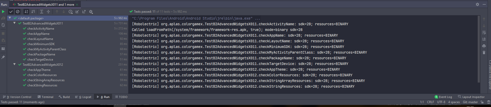

<br/> <br/> <br/>
<br/> <br/> <br/>

### *Student start to upload drawable vector image and define new styles.*

<br/>

Creating Shape Based on formula :

based on formula  :

>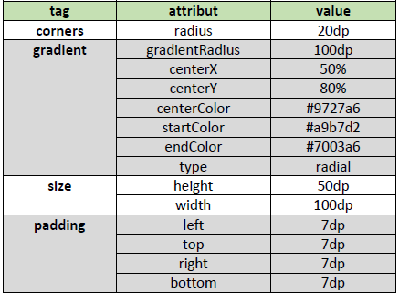

```xml
<shape xmlns:android="http://schemas.android.com/apk/res/android"
    android:shape="rectangle" >

    <corners
        android:radius="20dp"
        />

    <gradient
        android:gradientRadius="100dp"
        android:centerX="50%"
        android:centerY="80%"
        android:centerColor="#9727a6"
        android:startColor="#a9b7d2"
        android:endColor="#7003a6"
        android:type="radial"
        />

    <size
        android:height="50dp"
        android:width="100dp"
        />
    <padding
        android:left="7dp"
        android:top="7dp"
        android:right="7dp"
        android:bottom="7dp"
        />
</shape>
```

[code of creating shape](../../src/04.Aplas_B2/app/src/main/res/drawable/round_btn.xml)


Testing 2 :

>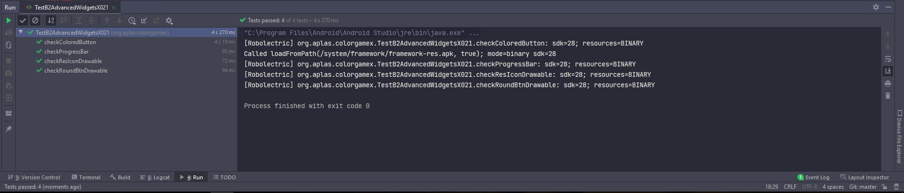

<br/> <br/> <br/>
<br/> <br/> <br/>

### *Student start to create UI for color Game.*

<br/>

Creating a layout so the UI looks like example below :

>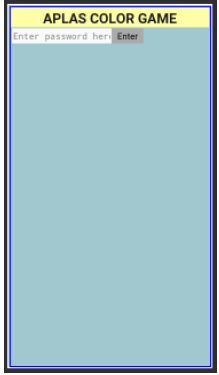

understanding Layout Code :

[code of MainActivty](../../src/04.Aplas_B2/app/src/main/res/layout/activity_layout.xml)

Testing 3 :

>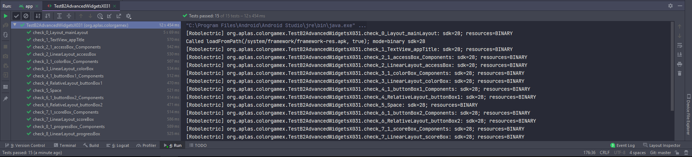

<br/> <br/> <br/>
<br/> <br/> <br/>

### *Student start to define fields and make method for validation.*

<br/>

field Requirement :

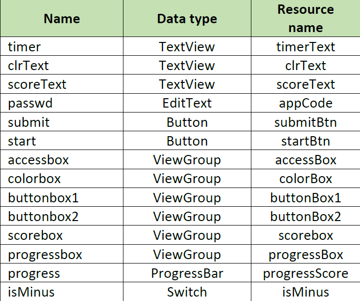

field code :

```java
    TextView timer;
    TextView clrText;
    TextView scoreText;
    EditText passwd;
    Button submit;
    Button start;
    ViewGroup accessbox;
    ViewGroup colorbox;
    ViewGroup buttonbox1;
    ViewGroup buttonbox2;
    ViewGroup scorebox;
    ViewGroup progressbox;
    ProgressBar progress;
    Switch isMinus;
```

Condition code :

```java
    public void openGame(View v) {
        String keyword = getString(R.string.keyword);
        String pass = passwd.getText().toString();
        if (keyword.equals(pass)) {
            passwd.setVisibility(View.INVISIBLE);
            submit.setVisibility(View.INVISIBLE);
            accessbox.setVisibility(View.VISIBLE);
            colorbox.setVisibility(View.VISIBLE);
            buttonbox1.setVisibility(View.VISIBLE);
            buttonbox2.setVisibility(View.VISIBLE);
            scorebox.setVisibility(View.VISIBLE);
            progressbox.setVisibility(View.VISIBLE);
            Toast.makeText(getApplicationContext(), "Login Success", Toast.LENGTH_LONG).show();
        } else {
            passwd.setVisibility(View.VISIBLE);
            submit.setVisibility(View.VISIBLE);
            accessbox.setVisibility(View.VISIBLE);
            colorbox.setVisibility(View.INVISIBLE);
            buttonbox1.setVisibility(View.INVISIBLE);
            buttonbox2.setVisibility(View.INVISIBLE);
            scorebox.setVisibility(View.INVISIBLE);
            progressbox.setVisibility(View.INVISIBLE);
            Toast.makeText(getApplicationContext(), "Password is wrong", Toast.LENGTH_LONG).show();
        }
    }
```


[Code of Main Activity](../../src/04.Aplas_B2/app/src/main/java/org/aplas/colorgamex/MyActivity.java)

Testing 4 :

>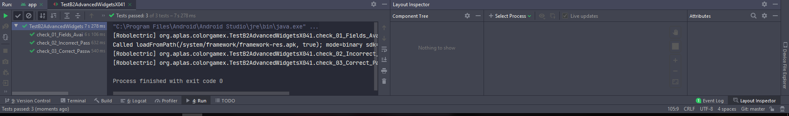


<br/> <br/> <br/>
<br/> <br/> <br/>

### *Student start to write methods to start activity and assign each element of activity.*


Field Requirement :

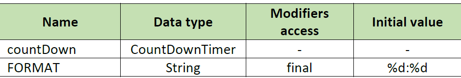

```java
    CountDownTimer countDown;
    final String FORMAT = "%d:%d";
```
create action listerner when radio button changed :

```java
    private void initTimer() {
        countDown = new CountDownTimer(getResources().getInteger(R.integer.maxtimer) * 1000, 1) {
            @Override
            public void onTick(long millisUntilFinished) {
                timer.setText("" + String.format(FORMAT, TimeUnit.MILLISECONDS.toSeconds(millisUntilFinished) - TimeUnit.MINUTES.toSeconds(TimeUnit.MILLISECONDS.toMinutes(millisUntilFinished)), TimeUnit.MILLISECONDS.toMillis(millisUntilFinished) - TimeUnit.SECONDS.toMillis(TimeUnit.MILLISECONDS.toSeconds(millisUntilFinished))));
            }

            @Override
            public void onFinish() {
                wrongSubmit();
            }
        };
    }
    
```
[Code of Main Activity](../../src/04.Aplas_B2/app/src/main/java/org/aplas/colorgamex/MyActivity.java)

<br/>

Testing 5 :

>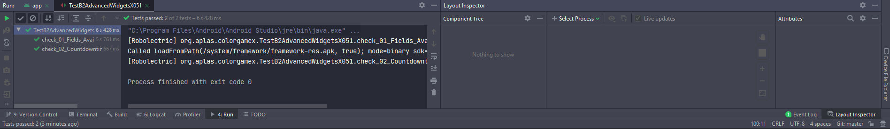

<br/> <br/> <br/>
<br/> <br/> <br/>

### *Student start to define string-array resource and make method in RadioGroup changed event to change Spinner content.*

<br/>

HashMap Explanation :

Android structures are composed of two arrays: ArrayMap uses a sorted array for the key hashes and the other one for the (key,value) items stored in the same order than the corresponding hash. SparseArray keeps the keys sorted in its first array and the values in the second one.

Complexity-wise, searching for an item stored in a HashMap is done in constant time on average, and with a logarithmic complexity for SparseArray and ArrayMap.
However, using a HashMap implies a memory overhead because the structure must be large enough to avoid hash collisions. Moreover, it does not allow you to have primitive types as key or value (int, long, etc.)

Field requirement:

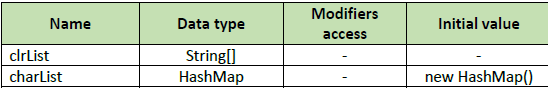

```java
    String[] clrList;
    HashMap charList = new HashMap();
```

example of hasmap usability 

```java
        clrList = getResources().getStringArray(R.array.colorList);
        String[] temp = getResources().getStringArray(R.array.charList);

        for (int i=0; i<clrList.length; i++) {
            charList.put(clrList[i],temp[i]);
        }
```

Testing 6 :

>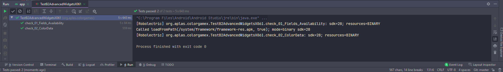

<br/> <br/> <br/>
<br/> <br/> <br/>

### *Student start to declare method to start the game and start the timer.*

<br/>

Field Requirement :
>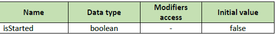

```java
    boolean isStarted = false;
```

used as comparation if the game already start or not 

code usability example :

```java
public void startGame(View v) {
        if (!isStarted) {
            progress.setProgress(0);
            scoreText.setText("0");
            start.setVisibility(View.INVISIBLE);
            isStarted = true;
            newGameStage();
        }
    }

    public void submitColor(View v) {
        if(isStarted){
            String charCode = ((Button)v).getText().toString();
            if (charCode.equals(charList.get(clrText.getText().toString()))) {
                correctSubmit();
            } else {
                wrongSubmit();
            }
        }
    }

    private void correctSubmit() {
        int newScore = progress.getProgress()+getResources().getInteger(R.integer.counter);
        updateScore(newScore);
        if(progress.getProgress()==getResources().getInteger(R.integer.maxScore)){
            countDown.cancel();
            timer.setText("COMPLETE");
            isStarted=false;
            start.setVisibility(View.VISIBLE);
        }else{
            newGameStage();
        }
    }
```

[Code of Main Activity](../../src/04.Aplas_B2/app/src/main/java/org/aplas/colorgamex/MyActivity.java)

Testing 7 :

>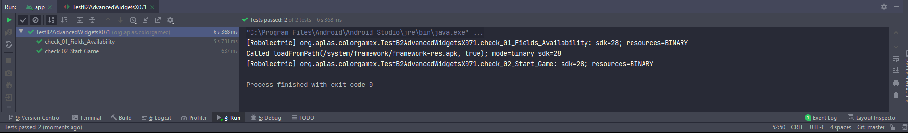

<br/> <br/> <br/>
<br/> <br/> <br/>

### *Student start to declare method to response correct and wrong answer then handle it with timer*

<br/>

create scoring based on this code :

```java
    private void updateScore(int score) {
        progress.setProgress(score);
        scoreText.setText(Integer.toString(score));
    }
```

correct or wrong answer :

```java
    private void correctSubmit() {
        int newScore = progress.getProgress()+getResources().getInteger(R.integer.counter);
        updateScore(newScore);
        if(progress.getProgress()==getResources().getInteger(R.integer.maxScore)){
            countDown.cancel();
            timer.setText("COMPLETE");
            isStarted=false;
            start.setVisibility(View.VISIBLE);
        }else{
            newGameStage();
        }
    }
    private void wrongSubmit() {
        if (isMinus.isChecked() && progress.getProgress()>0) {
            updateScore(progress.getProgress()-getResources().getInteger(R.integer.counter));
        }
        newGameStage();
    }
```

[Code of Main Activity](../../src/04.Aplas_B2/app/src/main/java/org/aplas/colorgamex/MyActivity.java)


Testing 8 :

>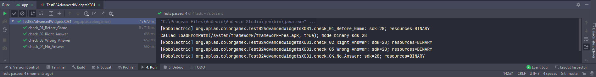


