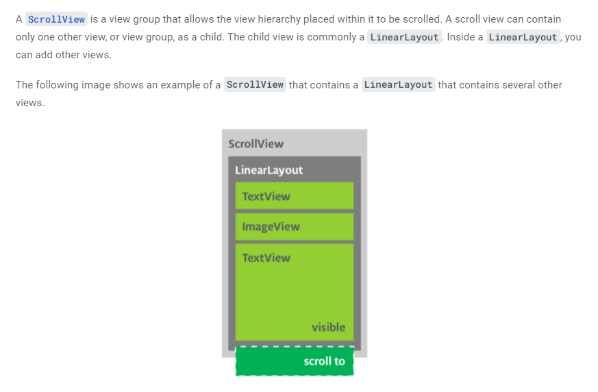
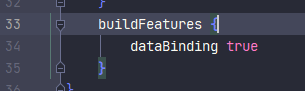
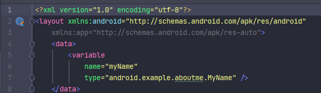
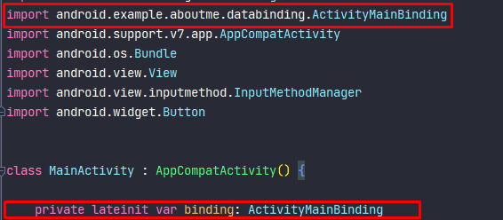
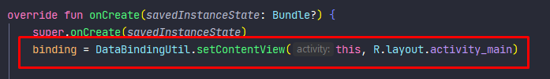
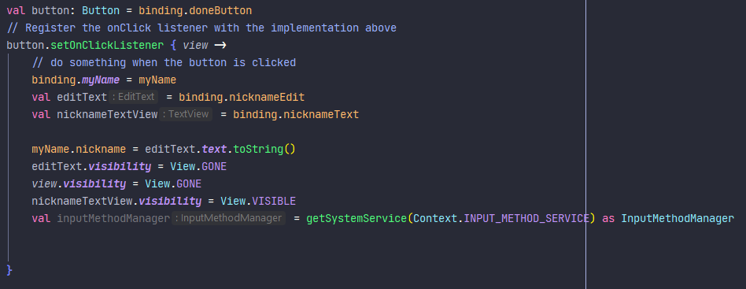
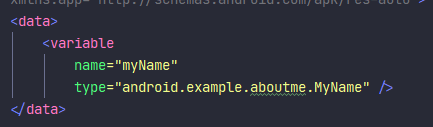
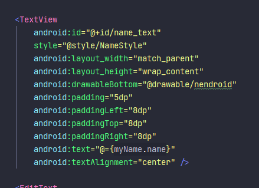

# 05 - scroll view 

## Tujuan Pembelajaran

1. How to work with View and ViewGroup.
2. How to arrange views in an Activity, using LinearLayout.
3. How to use ScrollView for displaying the scrollable content.
4. How to change the visibility of a View.
5. How to create and use string and dimension resources.
6. How to create a LinearLayout using Android Studio's Layout Editor.

## Materi Pembelajaran
1. Create the AboutMe app.
2. Add a TextView to the layout to display your name.
3. Add an ImageView.
4. Add a ScrollView to display scrollable text.

## result of this trial

source code and understanding :


<br/><br/>

## *Add a ScrollView*

<br/>

image understanding :

>

to do :

Open the activity_main.xml file in the Design tab.

Drag a scroll view into the layout by dragging it into the design editor, or into the Component Tree. Put the scroll view below the star image.

Switch to the Text tab to inspect the generated code.

```xml
// Auto generated code
<ScrollView
   android:layout_width="match_parent"
   android:layout_height="match_parent">

   <LinearLayout
       android:layout_width="match_parent"
       android:layout_height="wrap_content"
       android:orientation="vertical" />
</ScrollView>
```

output :

>

<br/> <br/> <br/>
<br/> <br/> <br/>

## *Data Binding Basic*

<br/>

to do :

enable data binding :

>

Change layout file to be usable with data bindinge.

>

import and init for using data binding

>

change how to call the layout

>

change how to do about action listener

>

set data saver on xml

>

call from resource string on class that has defined as binding

>