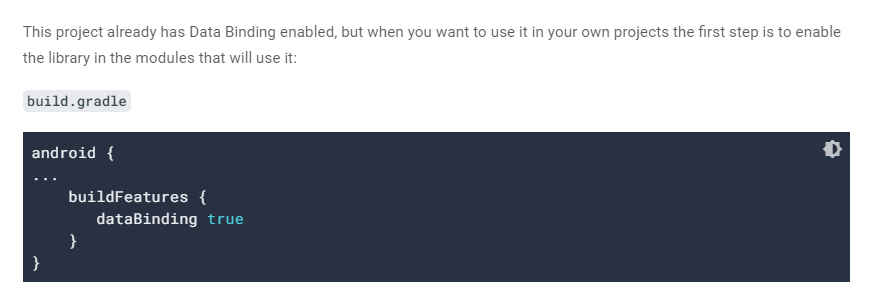
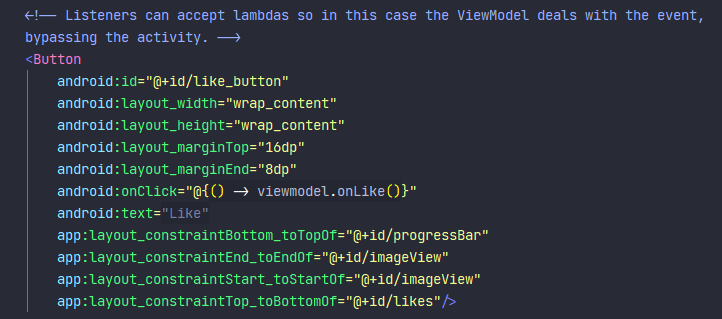

# 06 - Data Binding 

## Tujuan Pembelajaran

The Data Binding Library is an Android Jetpack library that allows you to bind UI components in your XML layouts to data sources in your app using a declarative format rather than programmatically, reducing boilerplate code.

## Prerequisites

This codelab has been designed for those with some Android development experience.

## What you'll do

In this codelab, you'll convert this app to Data Binding:


<br/><br/>

## *Enable Data Binding and convert the layout*

<br/>

image understanding :

>

to do :

Convert to data binding layout:

```xml
<layout xmlns:android="http://schemas.android.com/apk/res/android"
       xmlns:app="http://schemas.android.com/apk/res-auto"
       xmlns:tools="http://schemas.android.com/tools">
   <data>

   </data>
   <androidx.constraintlayout.widget.ConstraintLayout
           android:layout_width="match_parent"
           android:layout_height="match_parent">

       <TextView
```

Create two String layout variables inside the <data> tag.

```xml
 <data>
        <variable
                name="viewmodel"
                type="com.example.android.databinding.basicsample.data.SimpleViewModel"/>
    </data>
```

<br/> <br/> <br/>
<br/> <br/> <br/>

## *Change inflation and remove UI calls from activity*

<br/>

to do :

```kotlin
val binding: PlainActivityBinding = DataBindingUtil.setContentView(this, R.layout.solution)

        binding.lifecycleOwner = this  // use Fragment.viewLifecycleOwner for fragments

        binding.viewmodel = viewModel
```


set action listener on the button XML


```xml
    android:onClick="@{() -> viewmodel.onLike()}"
```

>