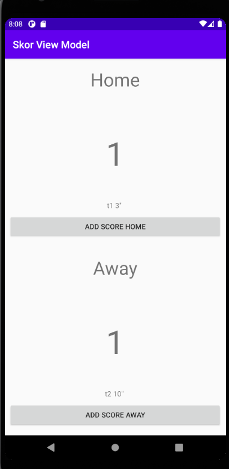

# 07 - View Model 

## Tujuan Pembelajaran

1. Mahasiswa mengenal tentang arsitektur MVVM.
2. Mahasiswa memahami lifecycle viewmodel pada MVVM.
3. Mahasiswa mampu menerapkan viewmodel pada Android.

## Prerequisites

This View Modelhas been designed for those with some Android development experience.

## What you'll do

Pada praktikum kali ini anda akan mempelajari untuk membangun aplikasi single activity multi fragment dengan menggunakan navigation component dan viewmodel. Pendekatan ini dikenal merupakan bagian dari pola MVVM (Model View ViewModel).


<br/><br/>

## *Enable Data Binding create view model*

<br/>


to do :

create mutable livedata with arraylist as data type

```java
public class ScoreViewModel extends ViewModel {
  private final MutableLiveData<ArrayList<GoalScorer>> homeGoalScorerList =
    new MutableLiveData<>(new ArrayList<GoalScorer>());
  private final MutableLiveData<ArrayList<GoalScorer>> awayGoalScorerList =
    new MutableLiveData<>(new ArrayList<GoalScorer>());

  public int getHomeScore() {
    return homeGoalScorerList.getValue().size();
  }

  public int getAwayScore() {
    return awayGoalScorerList.getValue().size();
  }
}
```

create bind to make view model

```java
public void onSaveClicked(View view) {
  Bundle bundle = new Bundle();
  bundle.putParcelable(ScoreFragment.SCORER_KEY, goalScorer);

  viewModel.setGoalScorer(requestKey, goalScorer);
  Navigation.findNavController(view).navigateUp();
}
```

<br/> <br/> <br/>
<br/> <br/> <br/>

## *Output*

<br/>

>:
>: