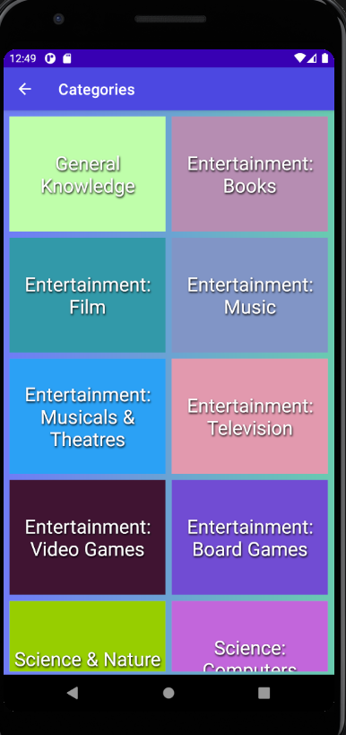

# 08 - Recycler View 

## Tujuan Pembelajaran

1. How to use the RecyclerView class to display items in a scrollable list.
2. How to dynamically add items to the RecyclerView as they become visible through scrolling.
3. How to perform an action when the user taps a specific item.
4. How to show a FAB and perform an action when the user taps it.

## Prerequisites

You should be able to:

1. Create and run apps in Android Studio.
2. Create and edit UI elements using the layout editor, entering XML code directly, and accessing elements from your Java code.
3. Create and use string resources.
4. Convert the text in a View to a string using getText().
5. Add an onClick() handler to a View.
6. Display a Toast message.

## What you'll do

1. Create a new app that uses a RecyclerView to display a list of items as a scrollable list and associate click behavior with the list items.
2. Use a FAB to let the user add items to the RecyclerView.

<br/><br/>

## *Enable Data Binding create view model*

<br/>


to do :

create adapter

```java
import android.content.Intent;
import android.graphics.Color;
import android.util.Log;
import android.view.LayoutInflater;
import android.view.View;
import android.view.ViewGroup;
import android.widget.TextView;

import androidx.annotation.NonNull;
import androidx.recyclerview.widget.RecyclerView;

import com.haidar.mulchoqu.R;
import com.haidar.mulchoqu.activity.DifficultActivity;

import java.util.ArrayList;
import java.util.Random;

public class GridCategoryAdapter extends RecyclerView.Adapter<GridCategoryAdapter.ViewHolder> {

    private ArrayList<String> categories = new ArrayList<>();
    private ArrayList<String> id_categories = new ArrayList<>();

    public GridCategoryAdapter(ArrayList<String> categories, ArrayList<String> categories_id) {
        this.categories.addAll(categories);
        this.id_categories.addAll(categories_id);
    }

    @NonNull
    @Override
    public ViewHolder onCreateViewHolder(@NonNull ViewGroup parent, int viewType) {
        View view = LayoutInflater.from(parent.getContext()).inflate(R.layout.cat_item_layout, parent, false);

        Random rnd = new Random();
        int color = Color.argb(255,rnd.nextInt(255),rnd.nextInt(255),rnd.nextInt(255));
        view.setBackgroundColor(color);

        return new ViewHolder(view);
    }

    @Override
    public void onBindViewHolder(@NonNull ViewHolder holder, int position) {
        holder.tvCategoryTitle.setText(categories.get(position));
        holder.tvCategoryTitle.setOnClickListener(new View.OnClickListener() {
            @Override
            public void onClick(View v) {
                Log.d("Info", "Button Pressed");
                Intent intent = new Intent(holder.tvCategoryTitle.getContext(), DifficultActivity.class);
                intent.putExtra("kategori",categories.get(position));
                intent.putExtra("id_kategori",id_categories.get(position));
                holder.tvCategoryTitle.getContext().startActivity(intent);
            }
        });
    }

    @Override
    public int getItemCount() {
        return categories.size();
    }

    public class ViewHolder extends  RecyclerView.ViewHolder {
        TextView tvCategoryTitle;

        public ViewHolder(@NonNull View itemView) {
            super(itemView);

            tvCategoryTitle = itemView.findViewById(R.id.categori_name);

        }
    }
}
```

set the adapter

i am using grid Recycle View using 2 span

```java
ArrayList<String> catList = new ArrayList<>();
    ArrayList<String> catList_id = new ArrayList<>();
    private void setKategori(){

        for(int i=0; i<daftar_kategori.size(); i++){
            catList.add(daftar_kategori.get(i).getName());
            catList_id.add(String.valueOf(daftar_kategori.get(i).getId()));
        }

        GridCategoryAdapter adapter = new GridCategoryAdapter(catList,catList_id);
        dataList.setAdapter(adapter);
        dataList.setLayoutManager(new GridLayoutManager(this, 2));
    }
```

set the XML files

i am using grid Recycle View using 2 span

```xml
<?xml version="1.0" encoding="utf-8"?>
<LinearLayout xmlns:android="http://schemas.android.com/apk/res/android"
    xmlns:app="http://schemas.android.com/apk/res-auto"
    xmlns:tools="http://schemas.android.com/tools"
    android:layout_width="match_parent"
    android:layout_height="match_parent"
    tools:context=".activity.KategoriActivity"
    android:orientation="vertical"
    android:background="@drawable/main_background"
    android:weightSum="10"

    >

    <include
        android:id="@+id/toolbar"
        layout = "@layout/toolbar"/>

    <androidx.recyclerview.widget.RecyclerView
        android:id="@+id/rv_category"
        android:layout_width="match_parent"
        android:layout_height="match_parent"
        android:layout_margin="4dp"
        />

</LinearLayout>
```

<br/> <br/> <br/>
<br/> <br/> <br/>

## *Output*

<br/>

>:
