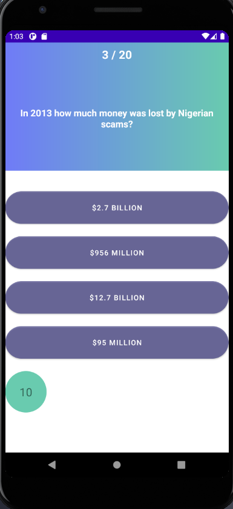
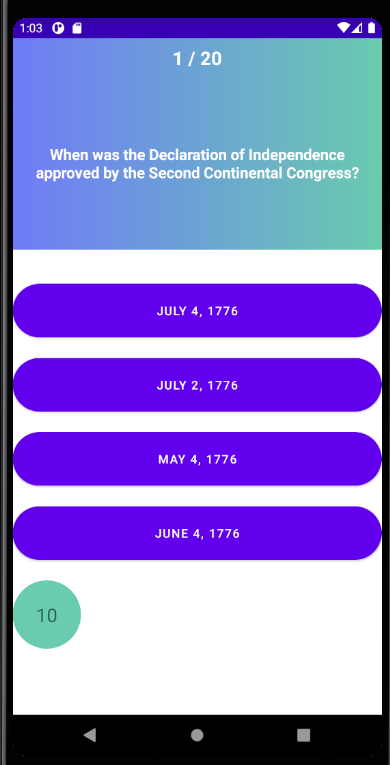

# 09 - Retrofit 

## Tujuan Pembelajaran

1. Penggunaan Retrofit dan implementasinya

## What you'll do

Pada praktikum kali ini anda akan mempelajari untuk membangun aplikasi dengan menggunakan Retrofit


<br/><br/>

## *Enable Data Binding create view model*

```java
implementation 'com.squareup.retrofit2:retrofit:(insert latest version)'
```

<br/>


to do :

create model to retrieve json

```java

package com.haidar.mulchoqu.model.kategori;

import java.util.List;
import com.google.gson.annotations.SerializedName;


public class Kategori {

    @SerializedName("trivia_categories")
    private List<TriviaCategoryModel> mTriviaCategories;

    public List<TriviaCategoryModel> getTriviaCategories() {
        return mTriviaCategories;
    }

    public void setTriviaCategories(List<TriviaCategoryModel> triviaCategories) {
        mTriviaCategories = triviaCategories;
    }

}
```

create model to save the data so json can be deprcycate


```java

package com.haidar.mulchoqu.model.kategori;

import com.google.gson.annotations.SerializedName;

public class TriviaCategoryModel {

    @SerializedName("id")
    private Long mId;
    @SerializedName("name")
    private String mName;

    public Long getId() {
        return mId;
    }

    public void setId(Long id) {
        mId = id;
    }

    public String getName() {
        return mName;
    }

    public void setName(String name) {
        mName = name;
    }

}

```

create interface retrofit

```java

package com.haidar.mulchoqu.retrofit;

import android.util.Log;

import com.haidar.mulchoqu.model.kategori.Kategori;
import com.haidar.mulchoqu.model.kategori.TriviaCategoryModel;
import com.haidar.mulchoqu.model.soal.SoalModel;

import retrofit2.Call;
import retrofit2.http.GET;
import retrofit2.http.Path;
import retrofit2.http.Query;
import retrofit2.http.Url;

public interface ApiEndPoint {
    @GET("api.php?amount=20&category=27&difficulty=medium&type=multiple")
    Call<SoalModel> getData();

    @GET()
    Call<SoalModel> getSoal(@Url String url);

    @GET("api_category.php")
    Call<Kategori> getKategori();


}


```

create interface retrofit

```java

package com.haidar.mulchoqu.retrofit;

import retrofit2.Retrofit;
import retrofit2.converter.gson.GsonConverterFactory;

public class ApiService {

    private static String BASE_URL = "https://opentdb.com/";
    private static Retrofit retrofit;
    public static ApiEndPoint endpoint(){
        retrofit = new Retrofit.Builder()
                .baseUrl(BASE_URL)
                .addConverterFactory(GsonConverterFactory.create())
                .build();
        return retrofit.create(ApiEndPoint.class);
    }
}


```
get data

```java

 private void getDataFromApi(String url) {

        ApiService.endpoint().getSoal(url).enqueue(new Callback<SoalModel>() {
            @Override
            public void onResponse(Call<SoalModel> call, Response<SoalModel> response) {
                daftar_soal  = response.body().getResults();
                setQuestion();
            }

            @Override
            public void onFailure(Call<SoalModel> call, Throwable t) {
                Log.d(Tag, t.getMessage());
            }
        });
    }


```
<br/> <br/> <br/>
<br/> <br/> <br/>

## *Output*

<br/>

>:
>: