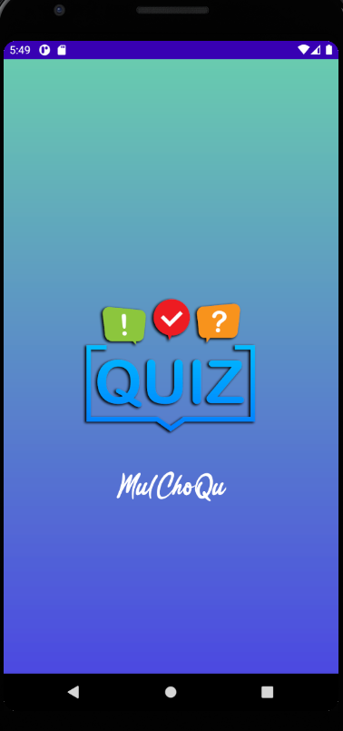
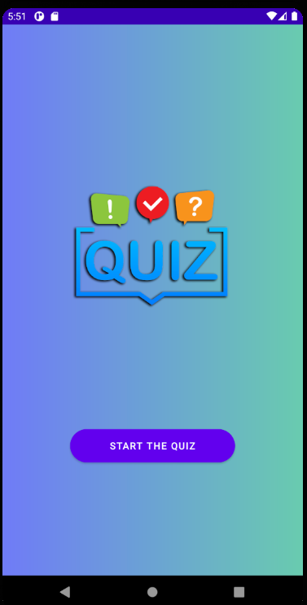
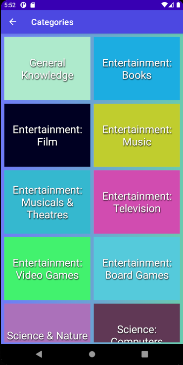
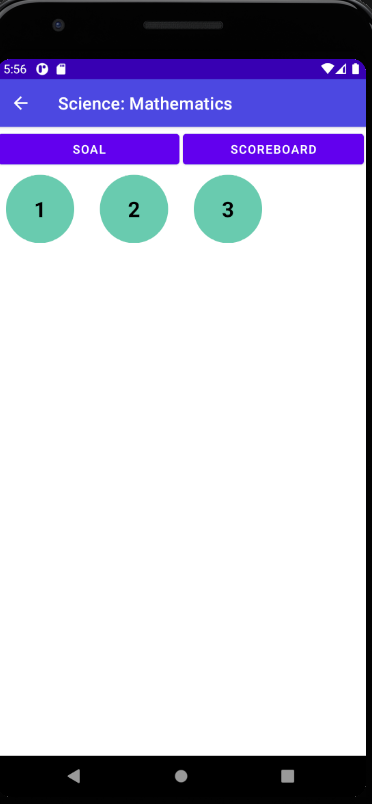
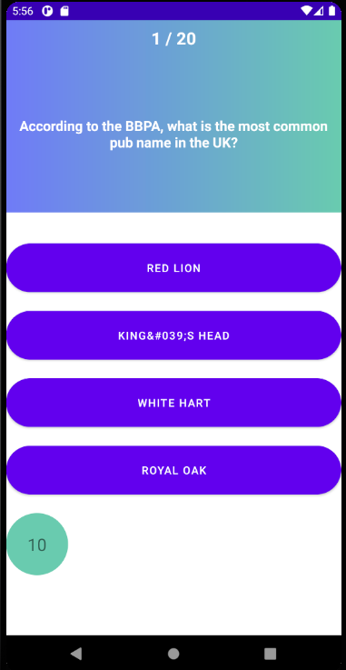
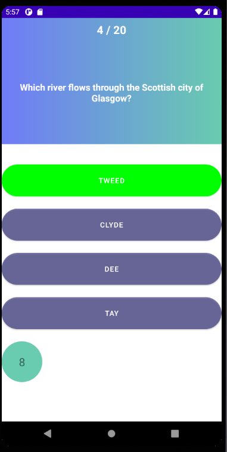
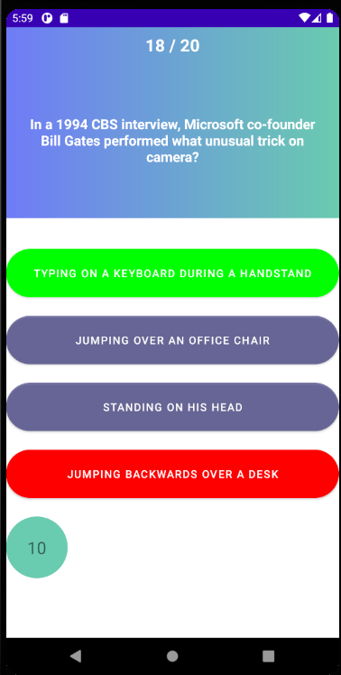
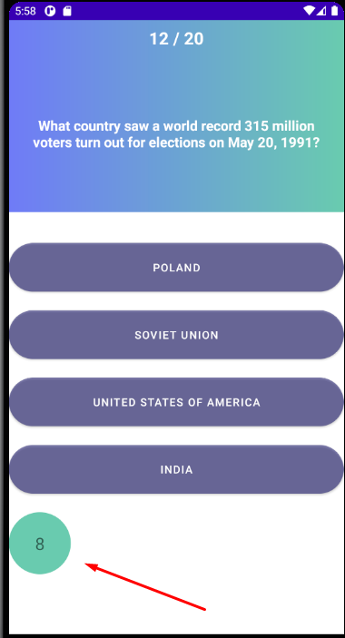
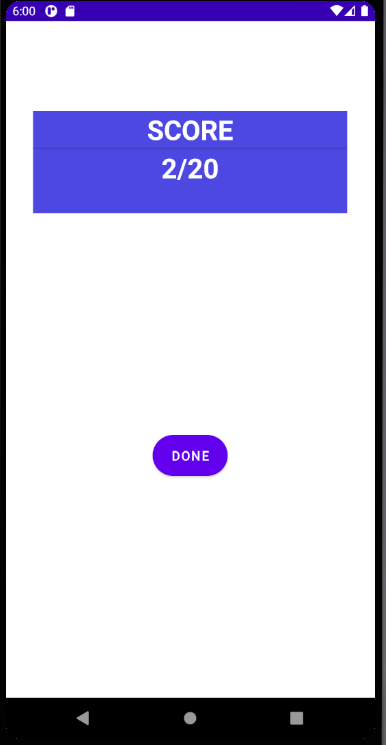

# 10 - Quiz Berbasis Api Trivia DB / MulChoQU

## Mulchoqu

    Sebuah Aplikasi Android yang diperuntukkan untuk memenuhi tugas akhir Pemrograman Android berbasis bahasa Java 

  

## Deskripsi Aplikasi

    Aplikasi ini bertujuan untuk memenuhi kriteria tugas akhir mata Kuliah Pemrograman Android 

    Aplikasi ini di buat berdasarkan QUIZ yang di ambil dari API :
    https://opentdb.com/

    Aplikasi ini membutuhkan koneksi Internet dalam penggunaannya

    Aplikasi ini berbasis bahasa pemrograman java

## Indentitas Pengembang (Developer)

    Dikembangkan Oleh :
    Haidar Sakti Oktafiansyah (1841720194) pada bulan Agustus 2020 - Desember 2020

## Fitur-fitur Aplikasi

|  |  |
|--|--|
| Splash Screen :  |   |
| Starting Layout : |   |
| Recycler View to Get Category  From Trivia APi using Grid View with 2 Span |   |
| Select the difficulties based on API |   |
| Question Acticiry to retriefe data from API |   |
| Green animate overlay when you click the Right Answer |   |
| red animate overlay when you click the Wrong |   |
| Countdown Timer |   |
| Scoring |   |
| Scoring |  Destroy all question data (you have to Install the APP) |

## Saran

    1. Pengaplikasian Airplane Mode ketika Quiz Berjalan
    2. Scoreboard
    3. User Auth
    4. Interactive UI
    5. Database Score

## Kesimpulan

    Pembuatan aplikasi ini tidak berfokus kepada hanya aplikasi ini, ada kalanya terhambat oleh penugasan coding yang lain sehingga tidak maksimal dalam penggunaan waktunya

    Adapun pengetahuan dasar yang belum pernah mengaplikasikan code android terkadang membingungkan

    Pematerian awal tentang Aplas dan MIT App inventor yang menyita waktu dalam pembelajaran semester ini

    Dalam pembuatan aplikasi ini saya belajar mengimplementasi ke 10 bab di atas secara universal

    Adapun materi pengkodingan dengan bahasa java pada android sudah mulai di tinggalkan dan alangkah baiknya jika pengajaran menggunakan (karena pada forum android sebagian besar menggunakan bahasa KOTLIN)

## Sumber Data/Referensi

    1. https://developer.android.com/courses/android-basics-kotlin/unit-1
    2. https://developer.android.com/courses/fundamentals-training/toc-v2
    3. https://stackoverflow.com/
    4. https://www.youtube.com/channel/UCEnbUTEcbS8fAQxgsKQI7Sw
    5. https://www.youtube.com/channel/UCjntzibNSsjjIOh0HoP9vxw
    6. https://www.youtube.com/channel/UCr0y1P0-zH2o3cFJyBSfAKg
    7. https://www.youtube.com/channel/UCnJFFAhsxC1DWrJqySPPAIw 
    8. https://www.youtube.com/channel/UCGjv_3tbzJ8yKuvacoqmO-Q
    9. https://www.youtube.com/channel/UCYLAirIEMMXtWOECuZAtjqQ
